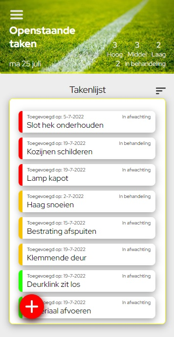
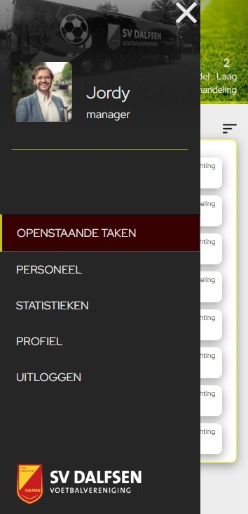
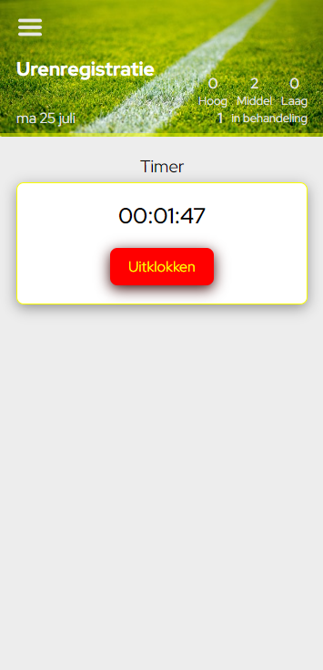

<div id="top"></div>
<!--
*** Thanks for checking out the Best-README-Template. If you have a suggestion
*** that would make this better, please fork the repo and create a pull request
*** or simply open an issue with the tag "enhancement".
*** Don't forget to give the project a star!
*** Thanks again! Now go create something AMAZING! :D
-->


<!-- PROJECT SHIELDS -->
<!--
*** I'm using markdown "reference style" links for readability.
*** Reference links are enclosed in brackets [ ] instead of parentheses ( ).
*** See the bottom of this document for the declaration of the reference variables
*** for contributors-url, forks-url, etc. This is an optional, concise syntax you may use.
*** https://www.markdownguide.org/basic-syntax/#reference-style-links
-->


<!-- PROJECT LOGO -->
<br />
<div align="center">
  <a href="https://github.com/github_username/repo_name">
  </a>

<h1 align="center">KantineApp</h1>

  <p align="center">
    A webapplication to stay on top of the workflow!
    <br />
    <br />
    <br />
  </p>
</div>


<!-- TABLE OF CONTENTS -->
<details>
  <summary>Table of Contents</summary>
  <ol>
    <li>
      <a href="#About-The-Project">About The Project</a>
      <ul>
        <li><a href="#built-with">Built With</a></li>
      </ul>
    </li>
    <li>
      <a href="#getting-started">Getting Started</a>
      <ul>
        <li><a href="#prerequisites">Prerequisites</a></li>
        <li><a href="#installation">Installation</a></li>
      </ul>
    </li>
    <li><a href="#usage">Usage</a></li>
  </ol>
club vrijwilligers</details>


<!-- ABOUT THE PROJECT -->

## About The Project

 &nbsp;&nbsp;  &nbsp;&nbsp; 

This application is a school project and is developed for the course Frontend Development. The KantineApp is an mobile
focused application for the sportsclub SV Dalfsen which lacks the tools to manage the workflow and keep track of the
volunteers working hours. By making it possible for managers to divide tasks among the volunteers and to monitor, the
overall workflow is improved. The volunteers are able to register their hours and complete their tasks, while the
managers can keep the total overview. The registration process is based upon GPS location so volunteers have to be on
the right location to start the registration.
<br><br>
To achieve this the Google Firebase backend was used. The various functionalities that Google Firebase has to offer have
been used, such as Firebase Authentication, Firebase Firestore and Firebase Storage. This application has been developed
for Dutch audience and is therefore written in Dutch.


<p align="right">(<a href="#top">back to top</a>)</p>

### Build with

* [React.js](https://reactjs.org/)
* [Google Firebase](https://firebase.google.com/)
* [Google Fonts](https://fonts.google.com/)

<p align="right">(<a href="#top">back to top</a>)</p>


<!-- GETTING STARTED -->

## Getting Started

To get the KantineApp up and running follow the steps below.

### Prerequisites

In order to install the required packets you have to install npm.

  ```sh
  npm install npm@latest -g
  ```

### Installation

1. Clone the repo.
   ```sh
   git clone git@github.com:MeijerN/frontend-kantineapp.git
   ```

2. Copy and paste the right start script command (line 19) in `package.json` for enabeling HTTPS protocol. This is
   required in order to use the Geolocation API.<br><br>
    - For macOS users: Open `package.json` and replace `XXX`
      for `xport HTTPS=true&&SSL_CRT_FILE=cert.pem&&SSL_KEY_FILE=key.pem react-scripts start`.<br><br>
    - For Windows users: Open `package.json` and replace `XXX`
      for `set HTTPS=true&&set SSL_CRT_FILE=cert.pem&&set SSL_KEY_FILE=key.pem&&react-scripts start`.<br><br>

3. Locate the Firebase credentials. These can be found in `firebase_credentials.txt` which is included in the `.zip`
   file provided by the developer.<br><br>

4. Create a `.env` file in the root directory with the following text:
    ```js
    REACT_APP_API_KEY=XXX
    REACT_APP_AUTH_DOMAIN=XXX
    REACT_APP_PROJECT_ID=XXX
    REACT_APP_STORAGE_BUCKET=XXX
    REACT_APP_MESSAGING_SENDER_ID=XXX
    REACT_APP_APP_ID=XXX
   ```
5. Replace the `XXX` for the Google Firebase credentials <u>without</u> parentheses.<br><br>

6. Install NPM packages
   ```sh
   npm install
   ```

<p align="right">(<a href="#top">back to top</a>)</p>


<!-- USAGE EXAMPLES -->

## Usage

### `npm start`

Runs the app in the development mode.\
Open [https://localhost:3000](http://localhost:3000) to view it in your browser.

The page will reload when you make changes.\
You may also see any lint errors in the console.

### `npm run build`

Builds the app for production to the `build` folder.\
It correctly bundles React in production mode and optimizes the build for the best performance.

The build is minified and the filenames include the hashes.\
Your app is ready to be deployed!

See the section about [deployment](https://facebook.github.io/create-react-app/docs/deployment) for more information.

_For more examples, please refer to the [Documentation](https://example.com)_

<p align="right">(<a href="#top">back to top</a>)</p>

